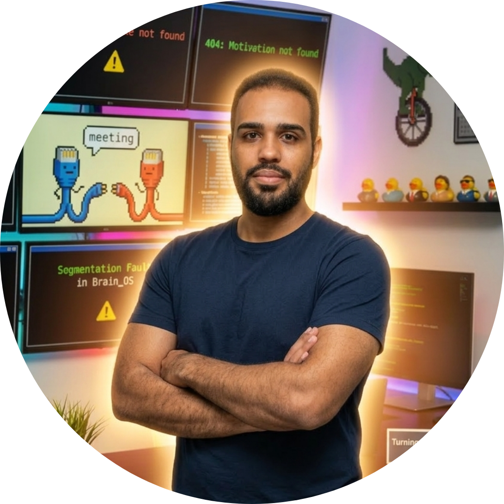

# Hi there 👋 I'm Edwin Marte Torres

  

## About Me

[Your bio and professional summary here. What do you do? What are you passionate about?]

- 📍 **Location:** Dominican Republic
- 💼 **Current Role:** Computer Science Engineer
- 🏢 **Company:** Cuantico Soluciones
- 🌐 **Website:** [Cuantico Soluciones](https://linktr.ee/CuanticoSoluciones)

## 🔭 What I'm Working On

I'm actually enrolled on [TrulyData](https://trulydata.com/) a Company that provides Insurance support and data management services. I'm currently working on a project that involves Managing Support for the Dev Team. It's been an exciting journey, and I'm learning a lot about Angular, C#, .NET and much more.

## 🌱 Currently Learning

- Google AppSheet
- C# API's
- Angular

## 💡 Skills & Technologies

### Languages

<!-- Add more language badges here -->

### Frontend

<!-- Add more frontend technologies -->

### Backend

<!-- Add more backend technologies -->

### Tools & Platforms

<!-- Add more tools -->

## 🏆 Featured Projects

### [Domino Counter]
**Description:** A Domino counter webssite with some local ads.
- 🔗 [Website](https://domino.cuanticosoluciones.net/)
- ⭐ Languages: [JavaScript, HTML, CSS]
- 📝 Key Features: [Score Selection], [Player Team Names Configuration], [Score Display, Update and Reset], [Local Ads]

### [Random Wallpaper Generator]
**Description:** A web application that generates random wallpapers. This was a small project I created to practice my frontend skills, have fun with design and to use as an OBS wait screen.
- 🔗 [Website](https://wallpaper.cuanticosoluciones.net/)
- ⭐ Languages: [JavaScript, HTML, CSS]
- 📝 Key Features: [Random Wallpaper Showcase], [It can work as a Full Screen Wait Screen for OBS], [Randomly Generated Backgrounds each 15 secs]

## 👯 Looking to Collaborate On

- [Smart Glasses]
- [Open source initiatives]

## 💬 Ask Me About

- [Software Development]
- [Web Development]
- [Wix Portfolio Creation]
- [SquareSpace Portfolio Creation]
- [Google Sites Portfolio Creation]
- [WordPress Portfolio Creation]
- [Google AppSheet]
- [Anything tech-related!]

## 📊 GitHub Stats

## 📫 How to Reach Me

- 📧 **Email:** [kdgpro15+github@gmail.com](mailto:kdgpro15+github@gmail.com)
- 🔗 **LinkedIn:** [Edwin Marte Torres](https://www.linkedin.com/in/edwin-marte/)
- 💼 **Portfolio:** [My Portfolio](https://linktr.ee/CuanticoSoluciones)

## ⚡ Fun Facts

- ⚡ [I'm Christian and I love technology!]
- 🎮 [I play META Quest 3 and I love it!]
- 📚 [Eating Lasagna is my favorite food!]

---

  

**Last Updated:** 03/16/2026
